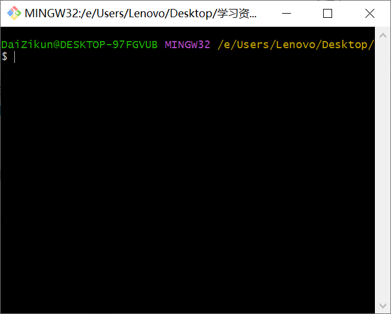

### git

首先去官网下载安装包，或者直接使用我提供的安装包，官网地址：[Git - Downloads (git-scm.com)](https://git-scm.com/download)

安装过程参考网上教程即可[参考1](https://blog.csdn.net/mukes/article/details/115693833)	[参考2](https://blog.csdn.net/weixin_44950987/article/details/102619708)

安装好之后在右键菜单里面可以看到<kbd>git bash here</kbd>，点击后就会打开一个终端，如下图。

在终端内输入`git clone https://git.nju.edu.cn/njuEE/awesomeee.git`即可下载资料库到本地，非常简单是不是。

比如下载下来之后的相对路径是`Desktop/awesomeee`，后续如果要进行其他git操作，应当先`cd awesomeee`进入本地仓库文件夹，或者在文件管理器中进入`awesomeee`文件夹再`git bash here`。

后续如果发现网站上的资料库有什么更新，只需在本地打开终端，输入`git pull`即可更新本地仓库。

[git add和commit合并操作](https://blog.csdn.net/littlehaes/article/details/104150941) 

[warning: LF will be replaced by CRLF in ** ](https://blog.csdn.net/man_zuo/article/details/88651416) 

 