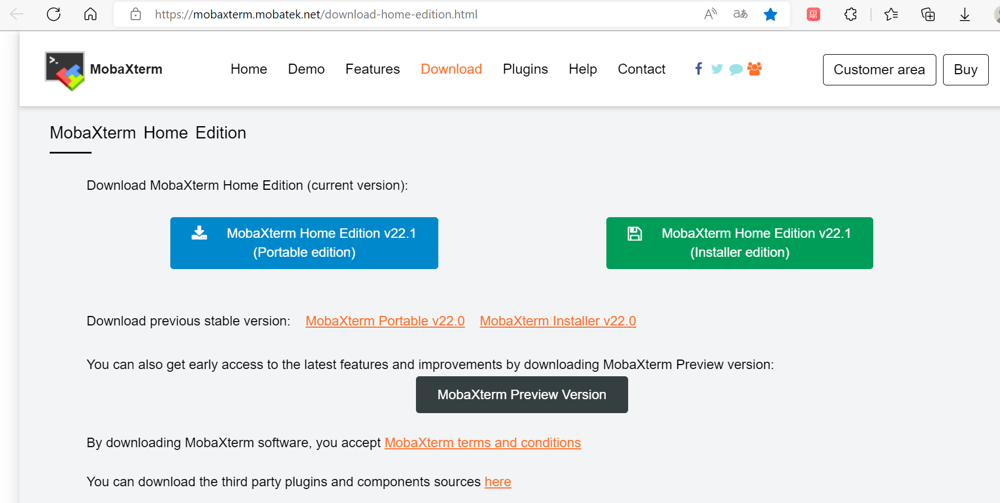
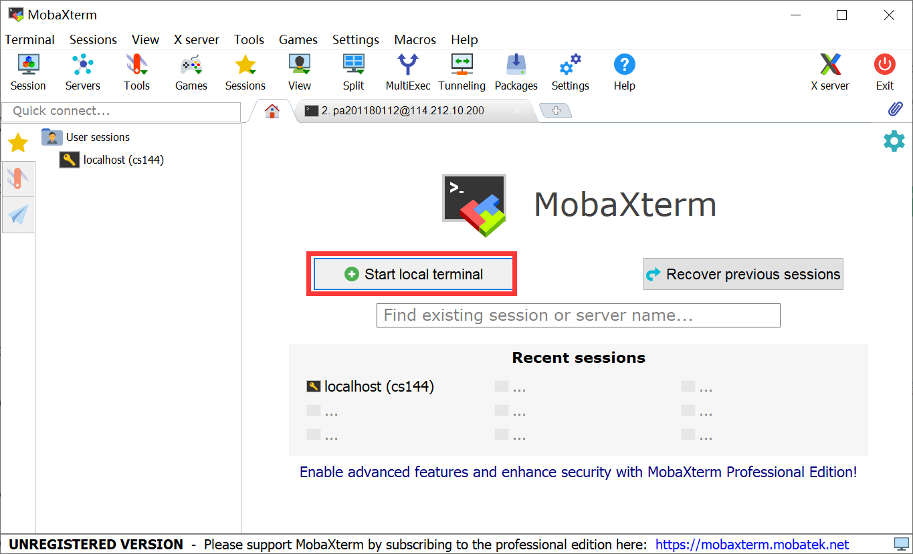
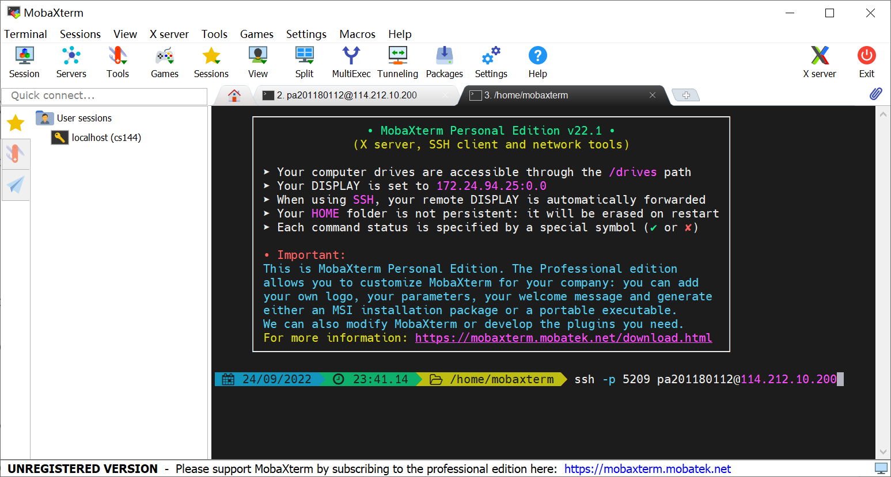
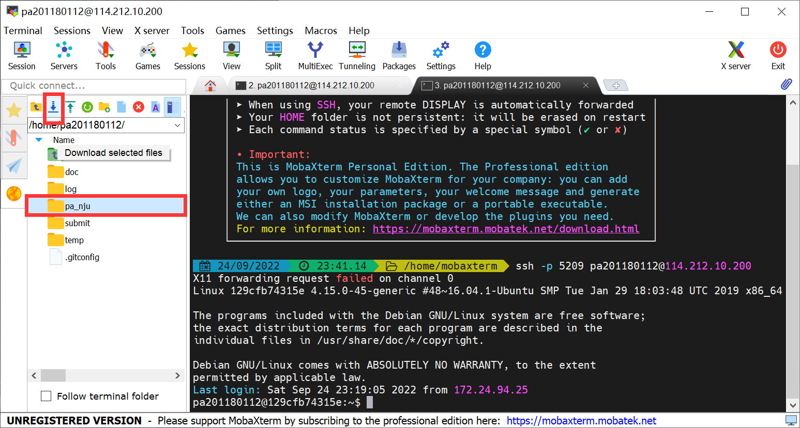

#### ssh远程登录虚拟机并下载文件到本地

上`ICS`课程时想把老师提供的框架代码下载下来，但用`fileZilla`不知为何ssh登录不上去，故改用了`MobaXterm`，不仅是一个优秀的终端，还能方便且直观地下载远程账户的文件。

官网下载地址：https://mobaxterm.mobatek.net/download-home-edition.html



个人喜欢Portable edition，无需安装直接使用。（便携版，也有些地方叫做绿色版）

###### 简单使用教程：

下载好之后解压缩打开，界面如下，选择<kbd>Start local terminal</kbd>,



在新打开的终端界面输入`ssh`命令

```shell
#比如我要访问ics的pa网站，就输入以下命令
ssh -p 5209 pa201180112@114.212.10.200
```



之后按照提示信息输入密码就访问成功了
可以选择记住密码，下次就可直接访问。

左侧图形化界面选择想要下载的文件/文件夹，然后点左上方的下载按钮即可下载到本地。



> 此外`MobaXterm`还有很多方便的功能，可以在使用中慢慢探索。
